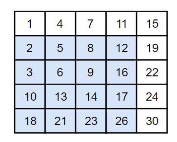
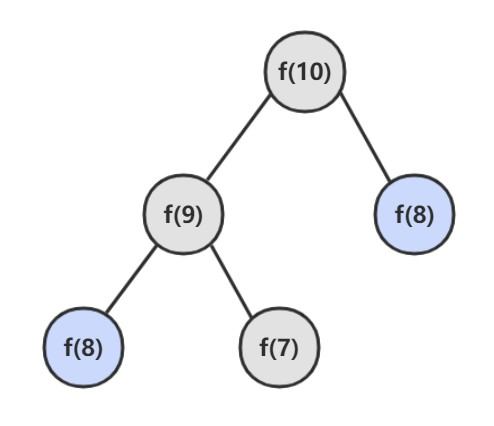

<!-- GFM-TOC -->
* [1. 字符串组合](#1-字符串组合)
* [2. 整数组合求和](#2-整数组合求和)
* [3. 数组中重复的数字](#3-数组中重复的数字)
* [4. 二维数组中的查找](#4-二维数组中的查找)
* [5. 替换空格](#5-替换空格)
* [6. 从尾到头打印链表](#6-从尾到头打印链表)
* [7. 重建二叉树](#7-重建二叉树)
* [8. 二叉树的下一个结点](#8-二叉树的下一个结点)
* [9. 用两个栈实现队列](#9-用两个栈实现队列)
* [10.1 斐波那契数列](#101-斐波那契数列)
* [10.2 跳台阶](#102-跳台阶)
* [10.3 矩形覆盖](#103-矩形覆盖)
* [10.4 变态跳台阶](#104-变态跳台阶)
* [11. 旋转数组的最小数字](#11-旋转数组的最小数字)
* [12. 矩阵中的路径](#12-矩阵中的路径)
* [13. 机器人的运动范围](#13-机器人的运动范围)
* [14. 剪绳子](#14-剪绳子)

* [参考文献](#参考文献)
<!-- GFM-TOC -->

# 1. 字符串组合

## 题目描述

给定三种类型的小球P、Q、R，每种小球的数量分别为np、nq、nr个。现在想讲这些小球排成一条直线，但是不允许相同类型的小球相邻，问有多少种排序方法。
如若np=2，nq=1,nr=1则共有6种排列方式：PQRP、QPRP、PRQP、PRPQ、RPQP以及PQPR。如果无法组合出合适的结果，则输出0.

### 输入
```code
一行以空格相隔的三个数，分别表示为np、nq、nr。
```

### 输出
```code
排列方法的数量。
```

### 样例输入
```code
2 1 1
```

### 样例输出
```code
6
```

## 解题思路
本题采用一种比较直接的方式进行解题，分为如下步骤：
1. 求解给定P、Q、R个数的时候的全排列，提供`Python`提供的`itertools.permutations`来实现，此时肯定有很多重复。
2. 去掉重复的情况，通过`Python`提供的`set`来实现。
3. 通过遍历找出相邻元素重复的串。
4. 求两个集合的差集，即为答案。

```python
import itertools
    

np, nq, nr = [int(k) for k in raw_input().split(" ")]

count = 0
result = []

for i in itertools.permutations("P"*np + "Q"*nq + "R"*nr,np + nq + nr):
    result.append(''.join(i))
    
result_same = []

for element in list(set(result)):
    for j in range(1, len(element)):
        if element[j-1] == element[j]:
          result_same.append(element)
          
ret_list = list(set(result)^set(result_same))

print len(ret_list)
```

# 2. 整数组合求和

## 题目描述

小米之家是成人糖果店。里面有很多便宜，好用，好玩的产品。中秋节到了，小米之家想给米粉准备一些固定金额大礼包。对于给定的一个金额，需要判断能不能用
不同种产品（一种产品在礼包最多出现一次）组合出来这个金额。聪明的你来帮帮米家的小伙伴吧。

### 输入
```code
输入N（N是正整数， N < = 200）
输入N个价格p（正整数， p <= 10000）用单空格分割
输入金额M（M是正整数，M <= 100000）
```

### 输出
```code
能组合出来输出1
否则输出0
```

### 样例输入
```code
6
99 199 1999 10000 39 1499
10238
```

### 样例输出
```code
1
```

## 解题思路
本题采用一种比较直接的方式进行解题，分为如下步骤：
1. 对输入np进行排序，方便后面快速结束。
2. 求解给定np时候的0~n个组合的和，提供`Python`提供的`itertools.permutations`来实现。
3. 如果较小的数相加已经大于目标，可以提前跳出本次循环。


```python
import itertools

n = int(raw_input())


np = [int(k) for k in raw_input().split(" ")]
np.sort()

sum_np = int(raw_input())

flag = 0

for i in range(n):
    for j in itertools.permutations(np, i):
        if sum(j) > sum_np:
            continue;
        if sum(j) == sum_np:
            flag = 1;
            break;
        
print flag
```


# 3. 数组中重复的数字

[NowCoder](https://www.nowcoder.com/practice/623a5ac0ea5b4e5f95552655361ae0a8?tpId=13&tqId=11203&tPage=1&rp=1&ru=/ta/coding-interviews&qru=/ta/coding-interviews/question-ranking)

## 题目描述

在一个长度为 n 的数组里的所有数字都在 0 到 n-1 的范围内。数组中某些数字是重复的，但不知道有几个数字是重复的，也不知道每个数字重复几次。请找出数组中任意一个重复的数字。例如，如果输入长度为 7 的数组 {2, 3, 1, 0, 2, 5}，那么对应的输出是第一个重复的数字 2。

要求复杂度为 O(N) + O(1)，也就是时间复杂度 O(N)，空间复杂度 O(1)。因此不能使用排序的方法，也不能使用额外的标记数组。牛客网讨论区这一题的首票答案使用 nums[i] + length 来将元素标记，这么做会有加法溢出问题。

## 解题思路

这种数组元素在 [0, n-1] 范围内的问题，可以将值为 i 的元素放到第 i 个位置上。

以 (2, 3, 1, 0, 2, 5) 为例：

```text-html-basic
position-0 : (2,3,1,0,2,5) // 2 <-> 1
             (1,3,2,0,2,5) // 1 <-> 3
             (3,1,2,0,2,5) // 3 <-> 0
             (0,1,2,3,2,5) // already in position
position-1 : (0,1,2,3,2,5) // already in position
position-2 : (0,1,2,3,2,5) // already in position
position-3 : (0,1,2,3,2,5) // already in position
position-4 : (0,1,2,3,2,5) // nums[i] == nums[nums[i]], exit
```

遍历到位置 4 时，该位置上的数为 2，但是第 2 个位置上已经有一个 2 的值了，因此可以知道 2 重复。

```java
public boolean duplicate(int[] nums, int length, int[] duplication) {
    if (nums == null || length <= 0)
        return false;
    for (int i = 0; i < length; i++) {
        while (nums[i] != i) {
            if (nums[i] == nums[nums[i]]) {
                duplication[0] = nums[i];
                return true;
            }
            swap(nums, i, nums[i]);
        }
    }
    return false;
}

private void swap(int[] nums, int i, int j) {
    int t = nums[i]; nums[i] = nums[j]; nums[j] = t;
}
```

```python
nums = [int(k) for k in raw_input().split(" ")]
print nums

def duplicate(nums):
    if len(nums) <= 0:
        return -1, False
    for i in range(len(nums)):
        while nums[i] != i:
            if nums[i] == nums[nums[i]]:
                return nums[i], True
            t = nums[i]
            nums[i]  = nums[nums[i]]
            nums[nums[i]] = t
            # nums[i], nums[nums[i]] = nums[nums[i]], nums[i]
    return -1, False
        
print duplicate(nums)
```

# 4. 二维数组中的查找

[NowCoder](https://www.nowcoder.com/practice/abc3fe2ce8e146608e868a70efebf62e?tpId=13&tqId=11154&tPage=1&rp=1&ru=/ta/coding-interviews&qru=/ta/coding-interviews/question-ranking)

## 题目描述

在一个二维数组中，每一行都按照从左到右递增的顺序排序，每一列都按照从上到下递增的顺序排序。请完成一个函数，输入这样的一个二维数组和一个整数，判断数组中是否含有该整数。

```html
Consider the following matrix:
[
  [1,   4,  7, 11, 15],
  [2,   5,  8, 12, 19],
  [3,   6,  9, 16, 22],
  [10, 13, 14, 17, 24],
  [18, 21, 23, 26, 30]
]

Given target = 5, return true.
Given target = 20, return false.
```

## 解题思路

从右上角开始查找。矩阵中的一个数，它左边的数都比它小，下边的数都比它大。因此，从右上角开始查找，就可以根据 target 和当前元素的大小关系来缩小查找区间。

复杂度：O(M + N) + O(1)

当前元素的查找区间为左下角的所有元素，例如元素 12 的查找区间如下：

<div align="center">  </div><br>

```java
public boolean Find(int target, int[][] matrix) {
    if (matrix == null || matrix.length == 0 || matrix[0].length == 0)
        return false;
    int rows = matrix.length, cols = matrix[0].length;
    int r = 0, c = cols - 1; // 从右上角开始
    while (r <= rows - 1 && c >= 0) {
        if (target == matrix[r][c])
            return true;
        else if (target > matrix[r][c])
            r++;
        else
            c--;
    }
    return false;
}
```

```python
target = int(input())

# nums = [[1, 4, 7, 11, 15], [2, 5, 8, 12, 19], [3, 6, 9, 16, 22], [10, 13, 14, 17, 24], [18, 21, 23, 26, 30]]

nums = eval(input())

def find(target, matrix):
    if len(matrix) == 0 or len(matrix[0]) == 0:
        return False
        
    rows, cols = len(matrix), len(matrix[0])
    r, c = 0, cols - 1
    
    while r <= rows - 1 and c >= 0:
        if target == matrix[r][c]:
            return True
        elif target > matrix[r][c]:
            r += 1
        else:
            c -= 1
    return False
    
print (find(target, nums))
```

# 5. 替换空格

[NowCoder](https://www.nowcoder.com/practice/4060ac7e3e404ad1a894ef3e17650423?tpId=13&tqId=11155&tPage=1&rp=1&ru=/ta/coding-interviews&qru=/ta/coding-interviews/question-ranking)

## 题目描述


将一个字符串中的空格替换成 "%20"。

```text
Input:
"We Are Happy"

Output:
"We%20Are%20Happy"
```

## 解题思路

在字符串尾部填充任意字符，使得字符串的长度等于替换之后的长度。因为一个空格要替换成三个字符（%20），因此当遍历到一个空格时，需要在尾部填充两个任意字符。

令 P1 指向字符串原来的末尾位置，P2 指向字符串现在的末尾位置。P1 和 P2从后向前遍历，当 P1 遍历到一个空格时，就需要令 P2 指向的位置依次填充 02%（注意是逆序的），否则就填充上 P1 指向字符的值。

从后向前遍是为了在改变 P2 所指向的内容时，不会影响到 P1 遍历原来字符串的内容。

```java
public String replaceSpace(StringBuffer str) {
    int P1 = str.length() - 1;
    for (int i = 0; i < P1 + 1; i++)
        if (str.charAt(i) == ' ')
            str.append("  ");

    int P2 = str.length() - 1;
    while (P1 >= 0 && P2 > P1) {
        char c = str.charAt(P1--);
        if (c == ' ') {
            str.setCharAt(P2--, '0');
            str.setCharAt(P2--, '2');
            str.setCharAt(P2--, '%');
        } else {
            str.setCharAt(P2--, c);
        }
    }
    return str.toString();
}
```

```python
target = input()

print (target.replace(" ", "%20"))
```


# 6. 从尾到头打印链表

[NowCoder](https://www.nowcoder.com/practice/d0267f7f55b3412ba93bd35cfa8e8035?tpId=13&tqId=11156&tPage=1&rp=1&ru=/ta/coding-interviews&qru=/ta/coding-interviews/question-ranking)

## 题目描述

输入链表的第一个节点，从尾到头反过来打印出每个结点的值。

<div align="center">  </div><br>

## 解题思路

### 使用栈

```java
public ArrayList<Integer> printListFromTailToHead(ListNode listNode) {
    Stack<Integer> stack = new Stack<>();
    while (listNode != null) {
        stack.add(listNode.val);
        listNode = listNode.next;
    }
    ArrayList<Integer> ret = new ArrayList<>();
    while (!stack.isEmpty())
        ret.add(stack.pop());
    return ret;
}
```

### 使用递归

```java
public ArrayList<Integer> printListFromTailToHead(ListNode listNode) {
    ArrayList<Integer> ret = new ArrayList<>();
    if (listNode != null) {
        ret.addAll(printListFromTailToHead(listNode.next));
        ret.add(listNode.val);
    }
    return ret;
}
```

### 使用头插法

利用链表头插法为逆序的特点。

头结点和第一个节点的区别：

- 头结点是在头插法中使用的一个额外节点，这个节点不存储值；
- 第一个节点就是链表的第一个真正存储值的节点。

```java
public ArrayList<Integer> printListFromTailToHead(ListNode listNode) {
    // 头插法构建逆序链表
    ListNode head = new ListNode(-1);
    while (listNode != null) {
        ListNode memo = listNode.next;
        listNode.next = head.next;
        head.next = listNode;
        listNode = memo;
    }
    // 构建 ArrayList
    ArrayList<Integer> ret = new ArrayList<>();
    head = head.next;
    while (head != null) {
        ret.add(head.val);
        head = head.next;
    }
    return ret;
}
```
### 使用 Collections.reverse()

```java
public ArrayList<Integer> printListFromTailToHead(ListNode listNode) {
ArrayList<Integer> ret = new ArrayList<>();
while (listNode != null) {
ret.add(listNode.val);
listNode = listNode.next;
}
Collections.reverse(ret);
return ret;
}
```

```python
def printListFromTailToHead(listNode):
        # write code here
        l = list()
        while listNode:
            l.append(listNode.val)
            listNode = listNode.next
        l.reverse()
        return l
```
# 7. 重建二叉树

[NowCoder](https://www.nowcoder.com/practice/8a19cbe657394eeaac2f6ea9b0f6fcf6?tpId=13&tqId=11157&tPage=1&rp=1&ru=/ta/coding-interviews&qru=/ta/coding-interviews/question-ranking)

## 题目描述

根据二叉树的前序遍历和中序遍历的结果，重建出该二叉树。假设输入的前序遍历和中序遍历的结果中都不含重复的数字。

```html
preorder = [3,9,20,15,7]
inorder =  [9,3,15,20,7]
```

<div align="center">  </div><br>

## 解题思路

前序遍历的第一个值为根节点的值，使用这个值将中序遍历结果分成两部分，左部分为树的左子树中序遍历结果，右部分为树的右子树中序遍历的结果。

```java
// 缓存中序遍历数组每个值对应的索引
private Map<Integer, Integer> indexForInOrders = new HashMap<>();

public TreeNode reConstructBinaryTree(int[] pre, int[] in) {
    for (int i = 0; i < in.length; i++)
        indexForInOrders.put(in[i], i);
    return reConstructBinaryTree(pre, 0, pre.length - 1, 0);
}

private TreeNode reConstructBinaryTree(int[] pre, int preL, int preR, int inL) {
    if (preL > preR)
        return null;
    TreeNode root = new TreeNode(pre[preL]);
    int inIndex = indexForInOrders.get(root.val);
    int leftTreeSize = inIndex - inL;
    root.left = reConstructBinaryTree(pre, preL + 1, preL + leftTreeSize, inL);
    root.right = reConstructBinaryTree(pre, preL + leftTreeSize + 1, preR, inL + leftTreeSize + 1);
    return root;
}
```

```python
# 返回构造的TreeNode根节点
def reConstructBinaryTree(self, pre, tin):
    # write code here
    if not pre or not tin:
        return None
    root = TreeNode(pre.pop(0))
    index = tin.index(root.val)
    root.left = self.reConstructBinaryTree(pre, tin[:index])
    root.right = self.reConstructBinaryTree(pre, tin[index + 1:])
    return root
```

# 8. 二叉树的下一个结点

[NowCoder](https://www.nowcoder.com/practice/9023a0c988684a53960365b889ceaf5e?tpId=13&tqId=11210&tPage=1&rp=1&ru=/ta/coding-interviews&qru=/ta/coding-interviews/question-ranking)

## 题目描述

给定一个二叉树和其中的一个结点，请找出中序遍历顺序的下一个结点并且返回。注意，树中的结点不仅包含左右子结点，同时包含指向父结点的指针。

```java
public class TreeLinkNode {
    int val;
    TreeLinkNode left = null;
    TreeLinkNode right = null;
    TreeLinkNode next = null;

    TreeLinkNode(int val) {
        this.val = val;
    }
}
```

## 解题思路

① 如果一个节点的右子树不为空，那么该节点的下一个节点是右子树的最左节点；

<div align="center">  </div><br>

② 否则，向上找第一个左链接指向的树包含该节点的祖先节点。

<div align="center">  </div><br>

```java
public TreeLinkNode GetNext(TreeLinkNode pNode) {
    if (pNode.right != null) {
        TreeLinkNode node = pNode.right;
        while (node.left != null)
            node = node.left;
        return node;
    } else {
        while (pNode.next != null) {
            TreeLinkNode parent = pNode.next;
            if (parent.left == pNode)
                return parent;
            pNode = pNode.next;
        }
    }
    return null;
}
```

```python
def GetNext(self, pNode):
    # write code here
    # pNode is None
    if not pNode:
        return pNode
    if pNode.right:
        node = pNode.right
        while node.left:
            node = node.left
        return node
    else:
        while pNode.next:
            parent = pNode.next
            if parent.left == pNode:
                return parent
            pNode = pNode.next
    # pNode not have the next node
    return None
```
# 9. 用两个栈实现队列

[NowCoder](https://www.nowcoder.com/practice/54275ddae22f475981afa2244dd448c6?tpId=13&tqId=11158&tPage=1&rp=1&ru=/ta/coding-interviews&qru=/ta/coding-interviews/question-ranking)

## 题目描述

用两个栈来实现一个队列，完成队列的 Push 和 Pop 操作。

## 解题思路

in 栈用来处理入栈（push）操作，out 栈用来处理出栈（pop）操作。一个元素进入 in 栈之后，出栈的顺序被反转。当元素要出栈时，需要先进入 out 栈，此时元素出栈顺序再一次被反转，因此出栈顺序就和最开始入栈顺序是相同的，先进入的元素先退出，这就是队列的顺序。

<div align="center">  </div><br>

```java
Stack<Integer> in = new Stack<Integer>();
Stack<Integer> out = new Stack<Integer>();

public void push(int node) {
    in.push(node);
}

public int pop() throws Exception {
    if (out.isEmpty())
        while (!in.isEmpty())
            out.push(in.pop());

    if (out.isEmpty())
        throw new Exception("queue is empty");

    return out.pop();
}
```

```python
# -*- coding:utf-8 -*-
class Solution:
    def __init__(self):
        self.stack1 = []
        self.stack2 = []
    def push(self, node):
        # write code here
        self.stack1.append(node)
    def pop(self):
        # return xx
        if self.stack2 == []:
            while self.stack1:
                self.stack2.append(self.stack1.pop())
            return self.stack2.pop()
        return self.stack2.pop()
```
# 10.1 斐波那契数列

[NowCoder](https://www.nowcoder.com/practice/c6c7742f5ba7442aada113136ddea0c3?tpId=13&tqId=11160&tPage=1&rp=1&ru=/ta/coding-interviews&qru=/ta/coding-interviews/question-ranking)

## 题目描述

求斐波那契数列的第 n 项，n <= 39。

<div align="center">1}\end{array}\right."/></div> <br>

## 解题思路

如果使用递归求解，会重复计算一些子问题。例如，计算 f(10) 需要计算 f(9) 和 f(8)，计算 f(9) 需要计算 f(8) 和 f(7)，可以看到 f(8) 被重复计算了。

<div align="center">  </div><br>

递归是将一个问题划分成多个子问题求解，动态规划也是如此，但是动态规划会把子问题的解缓存起来，从而避免重复求解子问题。

```java
public int Fibonacci(int n) {
    if (n <= 1)
        return n;
    int[] fib = new int[n + 1];
    fib[1] = 1;
    for (int i = 2; i <= n; i++)
        fib[i] = fib[i - 1] + fib[i - 2];
    return fib[n];
}
```

考虑到第 i 项只与第 i-1 和第 i-2 项有关，因此只需要存储前两项的值就能求解第 i 项，从而将空间复杂度由 O(N) 降低为 O(1)。

```java
public int Fibonacci(int n) {
    if (n <= 1)
        return n;
    int pre2 = 0, pre1 = 1;
    int fib = 0;
    for (int i = 2; i <= n; i++) {
        fib = pre2 + pre1;
        pre2 = pre1;
        pre1 = fib;
    }
    return fib;
}
```

由于待求解的 n 小于 40，因此可以将前 40 项的结果先进行计算，之后就能以 O(1) 时间复杂度得到第 n 项的值了。

```java
public class Solution {
    private int[] fib = new int[40];

    public Solution() {
        fib[1] = 1;
        fib[2] = 2;
        for (int i = 2; i < fib.length; i++)
            fib[i] = fib[i - 1] + fib[i - 2];
    }

    public int Fibonacci(int n) {
        return fib[n];
    }
}
```

```python
# -*- coding:utf-8 -*-
class Solution:
    
    def __init__(self):
        self.fib = [0,1]
        for i in range(2,40):
            self.fib.append(self.fib[i-1]+self.fib[i-2])
    def Fibonacci(self, n):
        # write code here
        return self.fib[n]
```
# 10.2 跳台阶

[NowCoder](https://www.nowcoder.com/practice/8c82a5b80378478f9484d87d1c5f12a4?tpId=13&tqId=11161&tPage=1&rp=1&ru=/ta/coding-interviews&qru=/ta/coding-interviews/question-ranking)

## 题目描述

一只青蛙一次可以跳上 1 级台阶，也可以跳上 2 级。求该青蛙跳上一个 n 级的台阶总共有多少种跳法。

## 解题思路

```java
public int JumpFloor(int n) {
    if (n <= 2)
        return n;
    int pre2 = 1, pre1 = 2;
    int result = 1;
    for (int i = 2; i < n; i++) {
        result = pre2 + pre1;
        pre2 = pre1;
        pre1 = result;
    }
    return result;
}
```

```python
# -*- coding:utf-8 -*-
class Solution:
    def jumpFloor(self, number):
        # write code here
        if number == 0:
            return number
        pre1, pre2 = 1, 1
        #result = 0
        for i in range(number):
            pre1, pre2 = pre2, pre1+pre2
        return pre1
```
# 10.3 矩形覆盖

[NowCoder](https://www.nowcoder.com/practice/72a5a919508a4251859fb2cfb987a0e6?tpId=13&tqId=11163&tPage=1&rp=1&ru=/ta/coding-interviews&qru=/ta/coding-interviews/question-ranking)

## 题目描述

我们可以用 2\*1 的小矩形横着或者竖着去覆盖更大的矩形。请问用 n 个 2\*1 的小矩形无重叠地覆盖一个 2\*n 的大矩形，总共有多少种方法？

## 解题思路

```java
public int RectCover(int n) {
    if (n <= 2)
        return n;
    int pre2 = 1, pre1 = 2;
    int result = 0;
    for (int i = 3; i <= n; i++) {
        result = pre2 + pre1;
        pre2 = pre1;
        pre1 = result;
    }
    return result;
}
```

```python
# -*- coding:utf-8 -*-
class Solution:
    def rectCover(self, number):
        # write code here
        if number == 0:
            return number
        pre1, pre2 = 1, 1
        #result = 0
        for i in range(number):
            pre1, pre2 = pre2, pre1+pre2
        return pre1
```
# 10.4 变态跳台阶

[NowCoder](https://www.nowcoder.com/practice/22243d016f6b47f2a6928b4313c85387?tpId=13&tqId=11162&tPage=1&rp=1&ru=/ta/coding-interviews&qru=/ta/coding-interviews/question-ranking)

## 题目描述

一只青蛙一次可以跳上 1 级台阶，也可以跳上 2 级... 它也可以跳上 n 级。求该青蛙跳上一个 n 级的台阶总共有多少种跳法。

## 解题思路

```java
public int JumpFloorII(int target) {
    int[] dp = new int[target];
    Arrays.fill(dp, 1);
    for (int i = 1; i < target; i++)
        for (int j = 0; j < i; j++)
            dp[i] += dp[j];
    return dp[target - 1];
}
```

```python
# -*- coding:utf-8 -*-
class Solution:
    def jumpFloorII(self, number):
        # write code here
        if number <= 0:
            return 0
        return pow(2, number-1)
```
# 11. 旋转数组的最小数字

[NowCoder](https://www.nowcoder.com/practice/9f3231a991af4f55b95579b44b7a01ba?tpId=13&tqId=11159&tPage=1&rp=1&ru=/ta/coding-interviews&qru=/ta/coding-interviews/question-ranking)

## 题目描述

把一个数组最开始的若干个元素搬到数组的末尾，我们称之为数组的旋转。输入一个非递减排序的数组的一个旋转，输出旋转数组的最小元素。

例如数组 {3, 4, 5, 1, 2} 为 {1, 2, 3, 4, 5} 的一个旋转，该数组的最小值为 1。

## 解题思路

在一个有序数组中查找一个元素可以用二分查找，二分查找也称为折半查找，每次都能将查找区间减半，这种折半特性的算法时间复杂度都为 O(logN)。

本题可以修改二分查找算法进行求解：

- 当 nums[m] <= nums[h] 的情况下，说明解在 [l, m] 之间，此时令 h = m；
- 否则解在 [m + 1, h] 之间，令 l = m + 1。

```java
public int minNumberInRotateArray(int[] nums) {
    if (nums.length == 0)
        return 0;
    int l = 0, h = nums.length - 1;
    while (l < h) {
        int m = l + (h - l) / 2;
        if (nums[m] <= nums[h])
            h = m;
        else
            l = m + 1;
    }
    return nums[l];
}
```

如果数组元素允许重复的话，那么就会出现一个特殊的情况：nums[l] == nums[m] == nums[h]，那么此时无法确定解在哪个区间，需要切换到顺序查找。例如对于数组 {1,1,1,0,1}，l、m 和 h 指向的数都为 1，此时无法知道最小数字 0 在哪个区间。

```java
public int minNumberInRotateArray(int[] nums) {
    if (nums.length == 0)
        return 0;
    int l = 0, h = nums.length - 1;
    while (l < h) {
        int m = l + (h - l) / 2;
        if (nums[l] == nums[m] && nums[m] == nums[h])
            return minNumber(nums, l, h);
        else if (nums[m] <= nums[h])
            h = m;
        else
            l = m + 1;
    }
    return nums[l];
}

private int minNumber(int[] nums, int l, int h) {
    for (int i = l; i < h; i++)
        if (nums[i] > nums[i + 1])
            return nums[i + 1];
    return nums[l];
}
```

```python
# -*- coding:utf-8 -*-
class Solution:
    def minNumberInRotateArray(self, rotateArray):
        # write code here
        if len(rotateArray) == 0:
            return 0
        return min(rotateArray)
```

# 12. 矩阵中的路径

[NowCoder](https://www.nowcoder.com/practice/c61c6999eecb4b8f88a98f66b273a3cc?tpId=13&tqId=11218&tPage=1&rp=1&ru=/ta/coding-interviews&qru=/ta/coding-interviews/question-ranking)

## 题目描述

请设计一个函数，用来判断在一个矩阵中是否存在一条包含某字符串所有字符的路径。路径可以从矩阵中的任意一个格子开始，每一步可以在矩阵中向左，向右，向上，向下移动一个格子。如果一条路径经过了矩阵中的某一个格子，则该路径不能再进入该格子。

例如下面的矩阵包含了一条 bfce 路径。

<div align="center">  </div><br>

## 解题思路

```java
private final static int[][] next = {{0, -1}, {0, 1}, {-1, 0}, {1, 0}};
private int rows;
private int cols;

public boolean hasPath(char[] array, int rows, int cols, char[] str) {
    if (rows == 0 || cols == 0)
        return false;
    this.rows = rows;
    this.cols = cols;
    boolean[][] marked = new boolean[rows][cols];
    char[][] matrix = buildMatrix(array);
    for (int i = 0; i < rows; i++)
        for (int j = 0; j < cols; j++)
            if (backtracking(matrix, str, marked, 0, i, j))
                return true;
    return false;
}

private boolean backtracking(char[][] matrix, char[] str, boolean[][] marked, int pathLen, int r, int c) {
    if (pathLen == str.length)
        return true;
    if (r < 0 || r >= rows || c < 0 || c >= cols || matrix[r][c] != str[pathLen] || marked[r][c])
        return false;
    marked[r][c] = true;
    for (int[] n : next)
        if (backtracking(matrix, str, marked, pathLen + 1, r + n[0], c + n[1]))
            return true;
    marked[r][c] = false;
    return false;
}

private char[][] buildMatrix(char[] array) {
    char[][] matrix = new char[rows][cols];
    for (int i = 0, idx = 0; i < rows; i++)
        for (int j = 0; j < cols; j++)
            matrix[i][j] = array[idx++];
    return matrix;
}
```

```python
# -*- coding:utf-8 -*-
class Solution:
    def hasPath(self, matrix, rows, cols, path):
        # write code here
        for i in range(rows):
            for j in range(cols):
                if matrix[i*cols+j] == path[0]:
                    if self.find(list(matrix),rows,cols,path[1:],i,j):
                        return True
        return False
    def find(self,matrix,rows,cols,path,i,j):
        if not path:
            return True
        matrix[i*cols+j]='0'
        if j+1<cols and matrix[i*cols+j+1]==path[0]:
            return self.find(matrix,rows,cols,path[1:],i,j+1)
        elif j-1>=0 and matrix[i*cols+j-1]==path[0]:
            return self.find(matrix,rows,cols,path[1:],i,j-1)
        elif i+1<rows and matrix[(i+1)*cols+j]==path[0]:
            return self.find(matrix,rows,cols,path[1:],i+1,j)
        elif i-1>=0 and matrix[(i-1)*cols+j]==path[0]:
            return self.find(matrix,rows,cols,path[1:],i-1,j)
        else:
            return False
    
    
    
    def buildMatrix(self, matrix):
        array = [[0]*self.cols for i in range(self.rows)]
        for i in range(self.rows):
            idx = 0
            for j in range(self.cols):
                array[i][j] = matrix[idx]
                idx += 1
        return array
```
# 13. 机器人的运动范围

[NowCoder](https://www.nowcoder.com/practice/6e5207314b5241fb83f2329e89fdecc8?tpId=13&tqId=11219&tPage=1&rp=1&ru=/ta/coding-interviews&qru=/ta/coding-interviews/question-ranking)

## 题目描述

地上有一个 m 行和 n 列的方格。一个机器人从坐标 (0, 0) 的格子开始移动，每一次只能向左右上下四个方向移动一格，但是不能进入行坐标和列坐标的数位之和大于 k 的格子。

例如，当 k 为 18 时，机器人能够进入方格 (35,37)，因为 3+5+3+7=18。但是，它不能进入方格 (35,37)，因为 3+5+3+8=19。请问该机器人能够达到多少个格子？

## 解题思路

```java
private static final int[][] next = {{0, -1}, {0, 1}, {-1, 0}, {1, 0}};
private int cnt = 0;
private int rows;
private int cols;
private int threshold;
private int[][] digitSum;

public int movingCount(int threshold, int rows, int cols) {
    this.rows = rows;
    this.cols = cols;
    this.threshold = threshold;
    initDigitSum();
    boolean[][] marked = new boolean[rows][cols];
    dfs(marked, 0, 0);
    return cnt;
}

private void dfs(boolean[][] marked, int r, int c) {
    if (r < 0 || r >= rows || c < 0 || c >= cols || marked[r][c])
        return;
    marked[r][c] = true;
    if (this.digitSum[r][c] > this.threshold)
        return;
    cnt++;
    for (int[] n : next)
        dfs(marked, r + n[0], c + n[1]);
}

private void initDigitSum() {
    int[] digitSumOne = new int[Math.max(rows, cols)];
    for (int i = 0; i < digitSumOne.length; i++) {
        int n = i;
        while (n > 0) {
            digitSumOne[i] += n % 10;
            n /= 10;
        }
    }
    this.digitSum = new int[rows][cols];
    for (int i = 0; i < this.rows; i++)
        for (int j = 0; j < this.cols; j++)
            this.digitSum[i][j] = digitSumOne[i] + digitSumOne[j];
}
```

```python
# -*- coding:utf-8 -*-
class Solution:
    def __init__(self):
        self.acc = 0
        
    def movingCount(self, threshold, rows, cols):
        # write code here
        self.threshold = threshold
        self.rows = rows
        self.cols = cols
        self.board = [[0 for _ in range(cols)] for _ in range(rows)]
        
        self.traverse(0,0)
        return self.acc
    
    def block(self, r, c):
            s = sum(map(int,str(r)+str(c)))
            return s>self.threshold
        
    def traverse(self, r, c):
            if not (0<=r<self.rows and 0<=c<self.cols): return
            if self.board[r][c]!=0: return
            if self.board[r][c]==-1 or self.block(r,c):
                self.board[r][c]=-1
                return
            self.board[r][c] = 1
            self.acc += 1
            self.traverse(r+1,c)
            self.traverse(r-1,c)
            self.traverse(r,c+1)
            self.traverse(r,c-1)
```

# 14. 剪绳子

[Leetcode](https://leetcode.com/problems/integer-break/description/)

## 题目描述

把一根绳子剪成多段，并且使得每段的长度乘积最大。

```html
n = 2
return 1 (2 = 1 + 1)

n = 10
return 36 (10 = 3 + 3 + 4)
```

## 解题思路

### 贪心

尽可能多剪长度为 3 的绳子，并且不允许有长度为 1 的绳子出现。如果出现了，就从已经切好长度为 3 的绳子中拿出一段与长度为 1 的绳子重新组合，把它们切成两段长度为 2 的绳子。

证明：当 n >= 5 时，3(n - 3) - 2(n - 2) = n - 5 >= 0。因此把长度大于 5 的绳子切成两段，令其中一段长度为 3 可以使得两段的乘积最大。

```java
public int integerBreak(int n) {
    if (n < 2)
        return 0;
    if (n == 2)
        return 1;
    if (n == 3)
        return 2;
    int timesOf3 = n / 3;
    if (n - timesOf3 * 3 == 1)
        timesOf3--;
    int timesOf2 = (n - timesOf3 * 3) / 2;
    return (int) (Math.pow(3, timesOf3)) * (int) (Math.pow(2, timesOf2));
}
```


```python
def integerBreak(n):
    if n < 2:
        return 0
    if n == 2:
        return 1
    if n == 3:
        return 2
    timesOf3 = n // 3
    if n - timesOf3 * 3 == 1:
        timesOf3 -= 1
    timesOf2 = (n - timesOf3 * 3) // 2
    return pow(3, timesOf3) * pow(2, timesOf2)
```

### 动态规划

```java
public int integerBreak(int n) {
    int[] dp = new int[n + 1];
    dp[1] = 1;
    for (int i = 2; i <= n; i++)
        for (int j = 1; j < i; j++)
            dp[i] = Math.max(dp[i], Math.max(j * (i - j), dp[j] * (i - j)));
    return dp[n];
}
```


# 参考文献

- 何海涛. 剑指 Offer[M]. 电子工业出版社, 2012.
