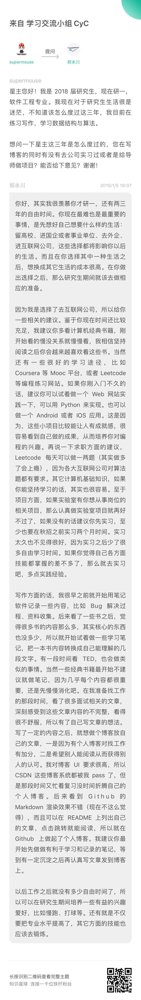
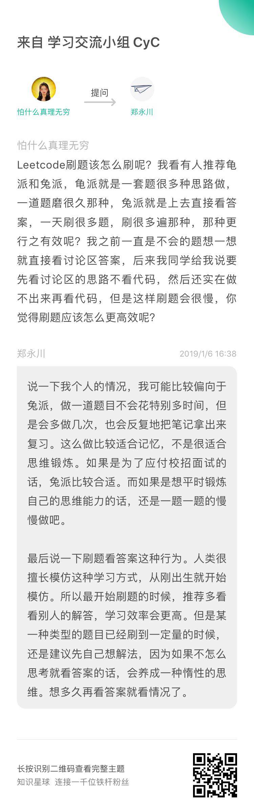
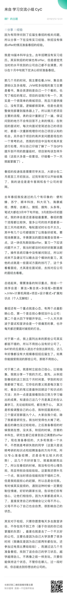

# 👩‍💻 面向用户

该星球主要面向正在找工作，以及已经工作并且想持续学习的小伙伴。

# 🍉 你能得到什么

该星球为大家提供一个高质量的学习交流平台，这个平台旨在建立一个一起努力和成长的氛围。在这里你可以提问在学习或求职过程中遇到的疑惑，能够得到星主以及不同人的回答以及建议。也会带你走进不止于技术的程序世界。 

# ⭐️ 加入方式

可以用微信直接扫下面的二维码直接，或者订阅专栏 https://xiaozhuanlan.com/CyC2018 ，加星主微信 zhengyochuan，备注 “你的姓名 + 已订阅专栏想要加入知识星球”，成功通过好友申请后，凭订阅截图即可免费加入。 

# 🔎 预览

学习和求职建议...

星球里其他同学的分享...

